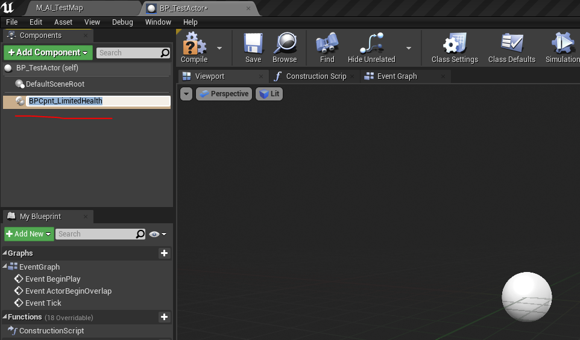
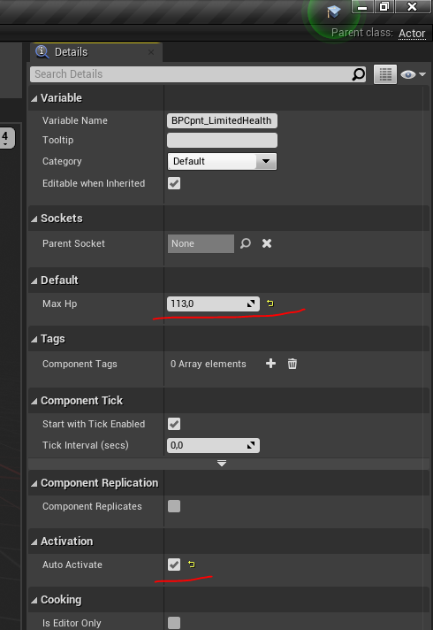

# Логика ИИ и иже с ней

В данном каталоге находится 3 директории, каждая из которых содержит иструменты для построения ботов и контроллеров для них. Обо всем по порядку.

## Health Management

### Общее описание

Для работы с HP у чего бы то ни было можно *и желательно* использовать `BPCpnt_LimitedHealth` (или его абстрактного брата `BPCpnt_Health` для создания новых компонентов, управляющих здоровьем экземпляров требуемых сущностей).

### Применение

Для использования `BPCpnt_LimitedHealth` достаточно добавить его в качестве компонента к нужному классу, как это представлено ниже

Далее необходимо настроить максимальный объем здоровья `Max Hp` и поставить галочку в `Auto Activate`

### Mortal Pawn и Mortal Character

Я не рекомендую использовать `BPCpnt_LimitedHealth` в чистом виде. Для повышения удобства и скорости работы были добавлены абстрактные классы `BP_MortalPawn` и `BP_MortalCharater`, в которых уже реализована обработка событий получения урона.

Будет куда лучше и проще создавать новые `Pawn` и `Character`, наследуя их от вышеупомянутых `BP_MortalPawn` и `BP_MortalCharacter`.

## Abilities (в разработке)

### Общее описание

Для работы с абилками был добавлен абстрактный компонент `BPCpnt_Ability`. Для создания новых абилок можно наследовать `BPCpnt_Ability` и переопределять функцию `execute`.

На данный момент также добавлен абстрактный наследник `BPCpnt_Ability` - `BPCpnt_TargetAbility` (по сути просто добавляющий поле `abilityTarget`).

У базового крипа атака реализована через компонент `BPCpnt_MeleeAttackAbility` (наследующий `BPCpnt_TargetAbility`).

### Применение

Для добавления какому-либо классу определенной абилки (например, вышеупомянутой `BPCpnt_MeleeAttackAbility`) необходимо добавить ее в компоненты этого класса и настроить по аналогии с `BPCpnt_LimitedHealth`.

## Башни

Сейчас в программе на примитивном уровне реализовано два типа башен - мили `BP_MeleeTower` и трон `BP_Throne`; причем первая из них пока не умеет наносить урон.

Добавлять новые башни можно, создавая наследников `BP_MortalPawn`.

## Крипы

Сейчас реализован контроллер для мили крипа `BPCtrl_MeleeCreep` с базовым поведением (ищет ближайшую башню; бьет ее, пока та не умрет; ищет следующую башню). Также добавлен блюпринт `BP_MeleeCreep`, для тестирования контроллера, но с этой же целью можно использовать и `ThirdPersonCharacter`.

## Тестовая карта

Ну и, разумеется, добавлена тестовая карта `M_AI_TestMap`, на которой можно посмотреть, как выглядит все вышеперечисленное